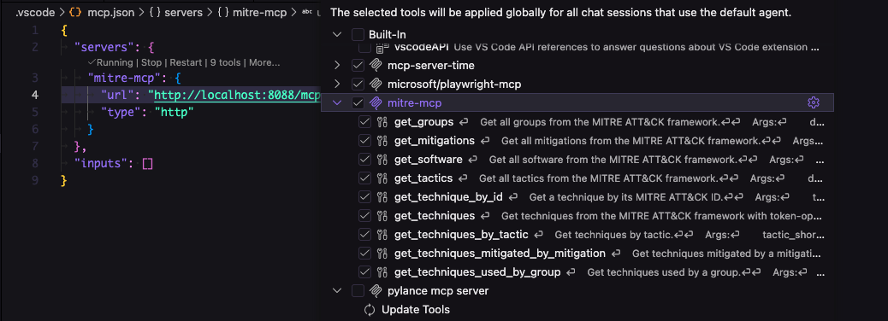
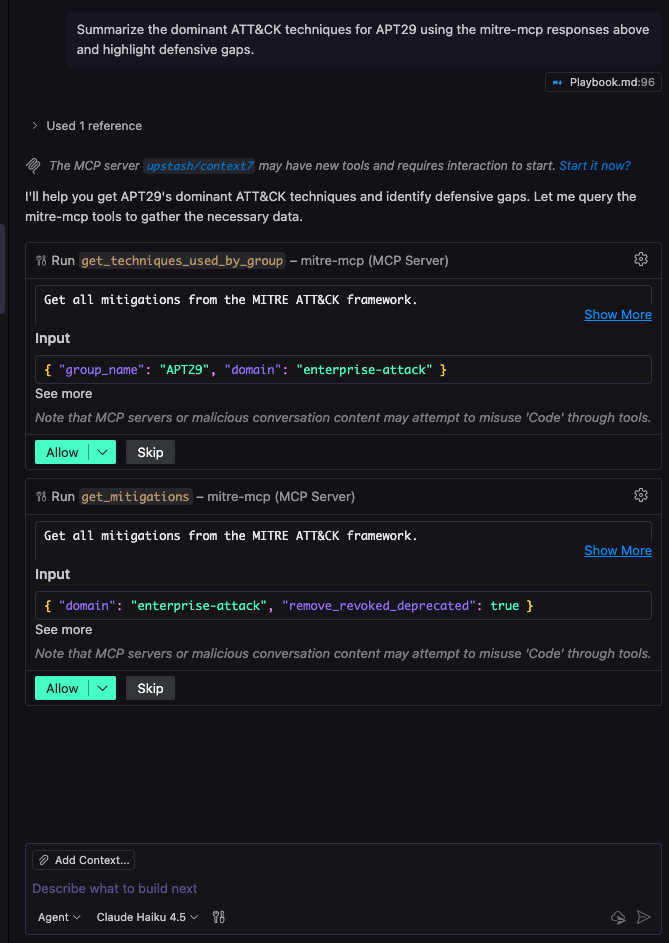
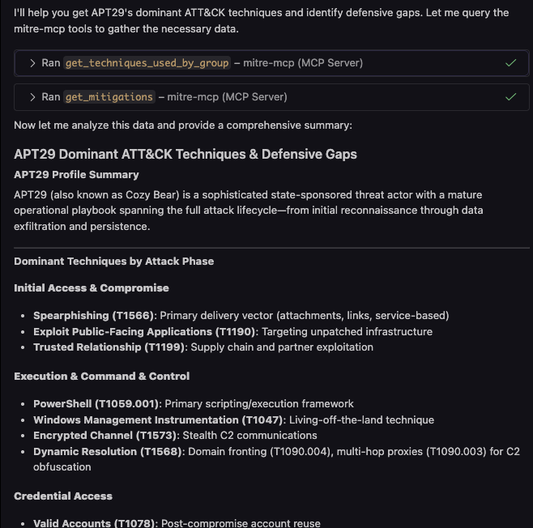

<!-- mcp-name: io.github.luongnv89/mitre-mcp -->
# mitre-mcp: MITRE ATT&CK MCP Server

[](https://registry.modelcontextprotocol.io)
<a href="https://pepy.tech/projects/mitre-mcp"></a>

[](https://pypi.org/project/mitre-mcp/)
[](https://pypi.org/project/mitre-mcp/)
[](https://github.com/montimage/mitre-mcp/actions/workflows/test.yml)
[](LICENSE)
[](pytest.ini)
[](https://github.com/psf/black)
[](https://github.com/pre-commit/pre-commit)

Production-ready Model Context Protocol (MCP) server that exposes the [MITRE ATT&CK®](https://attack.mitre.org/) framework to LLMs, AI assistants, and automation workflows. Built with the official MCP Python SDK and mitreattack-python library for secure, high-performance access to adversary tactics, techniques, groups, software, and mitigations.

**Available in the [MCP Registry](https://registry.modelcontextprotocol.io)** (search for `io.github.luongnv89/mitre-mcp`).

## Highlights

- **LLM-native experience** – Seamless integration with Claude, Windsurf, Cursor, and any MCP-compatible client
- **Secure-by-default** – Validated inputs, TLS verification, disk-space checks, and structured error handling
- **High performance** – O(1) technique lookups using pre-built indices (80-95% faster than scanning)
- **Flexible deployment** – stdio for local clients or HTTP server for web-based integrations

## Table of Contents

- [Features](#features)
- [Available MCP Tools](#available-mcp-tools)
- [Quick Start](#quick-start)
- [Documentation](#documentation)
- [Configuration](#configuration)
- [Performance](#performance)
- [Programmatic API](#programmatic-api)
- [Development](#development)
- [Troubleshooting](#troubleshooting)
- [FAQ](#faq)
- [License](#license)

## Features

- **Comprehensive MITRE ATT&CK Coverage** - All techniques, tactics, groups, software, and mitigations
- **Multi-Domain Support** - Enterprise, Mobile, and ICS ATT&CK domains
- **Intelligent Caching** - Automatic caching with configurable expiry (default: 24 hours)
- **Performance Optimized** - O(1) lookups using pre-built indices (80-95% faster)
- **Dual Transport Modes** - stdio for local clients, HTTP for web integrations
- **CORS-Enabled HTTP Server** - Async notifications and cross-origin request support
- **Comprehensive Testing** - 114 tests with 66% code coverage
- **Pre-commit Quality Checks** - Automated formatting, linting, type checking, and security scanning
- **Input Validation** - Secure-by-default with validated inputs and sanitized responses
- **Programmatic API** - Python and Node.js clients (see [API-INTEGRATION.md](API-INTEGRATION.md))

## Available MCP Tools

| Tool Name                                | Description                                                                     |
| ---------------------------------------- | ------------------------------------------------------------------------------- |
| `get_techniques`                         | List all techniques with filtering options                                       |
| `get_technique_by_id`                    | Look up specific technique by ID (e.g., T1055)                                  |
| `get_techniques_by_tactic`               | Get techniques for a specific tactic (e.g., persistence)                        |
| `get_tactics`                            | List all tactical categories                                                    |
| `get_groups`                             | List all threat actor groups                                                    |
| `get_techniques_used_by_group`           | Get techniques used by a specific group (e.g., APT29)                           |
| `get_software`                           | List malware and tools with filtering                                           |
| `get_mitigations`                        | List all security mitigations                                                   |
| `get_techniques_mitigated_by_mitigation` | Get techniques addressed by a specific mitigation                               |

## Quick Start

### Installation

1. **Create and activate a virtual environment:**

```bash
python3 -m venv .venv
source .venv/bin/activate  # On Windows: .venv\Scripts\activate.bat
```

2. **Install from PyPI:**

```bash
pip install mitre-mcp
```

3. **Verify installation:**

```bash
mitre-mcp --help
```

### HTTP Mode (Recommended)

**Start the server:**

```bash
mitre-mcp --http
```

**Expected output:**
```
2025-11-17 22:40:10,991 - mitre_mcp.mitre_mcp_server - INFO - Starting MITRE ATT&CK MCP Server (HTTP mode on localhost:8000)
======================================================================
MCP Client Configuration (Streamable HTTP Transport)
Server URL: http://localhost:8000
MCP Endpoint: http://localhost:8000/mcp

Add this to your MCP client configuration:
{
  "mcpServers": {
    "mitreattack": {
      "url": "http://localhost:8000/mcp"
    }
  }
}
======================================================================
```

**Configure your MCP client:**

Add this JSON to your client's configuration file:

```json
{
  "mcpServers": {
    "mitreattack": {
      "url": "http://localhost:8000/mcp"
    }
  }
}
```

**Configuration file locations:**
- **macOS (Claude Desktop)**: `~/Library/Application Support/Claude/claude_desktop_config.json`
- **Windows (Claude Desktop)**: `%APPDATA%\Claude\claude_desktop_config.json`
- **Linux (Claude Desktop)**: `~/.config/Claude/claude_desktop_config.json`
- **VSCode**: Configure in your MCP extension settings

**Custom host and port:**

```bash
mitre-mcp --http --host 0.0.0.0 --port 8080
```

Then use `http://your-server-ip:8080/mcp` in your client configuration.

**Why HTTP mode?**
- Multiple clients can connect simultaneously
- Better concurrency and async support
- Easier debugging with HTTP tools
- CORS support for web-based clients
- No path configuration needed

### stdio Mode (Alternative)

For local-only clients that require stdio transport:

```bash
mitre-mcp
```

**Client configuration:**

```json
{
  "mcpServers": {
    "mitreattack": {
      "command": "/absolute/path/to/.venv/bin/python",
      "args": ["-m", "mitre_mcp.mitre_mcp_server"]
    }
  }
}
```

**Note:** Use absolute paths. HTTP mode is recommended for most use cases.

### Force Data Download

Force a fresh download of MITRE ATT&CK data:

```bash
mitre-mcp --http --force-download
```

### Example Screenshots

**VSCode Configuration:**



**Tool Invocation:**



**Results:**



## Documentation

We provide three comprehensive guides tailored to different use cases:

### 1. Beginner's Guide

**[Beginner-Playbook.md](Beginner-Playbook.md)** - For those new to MITRE ATT&CK or cybersecurity

**Ideal for:**
- Non-technical users
- Security awareness training
- Basic threat intelligence
- General cybersecurity education

### 2. Advanced Playbook

**[Playbook.md](Playbook.md)** - For security professionals using MCP clients

**Ideal for:**
- Security analysts
- Threat hunters
- Incident responders
- Security engineers

Includes 10 ready-to-use scenarios:
- Threat Intelligence
- Detection Engineering
- Threat Hunting
- Red Teaming
- Security Assessment
- Incident Response
- Security Operations
- Security Training
- Vendor Evaluation
- Risk Management

### 3. API Integration Guide

**[API-INTEGRATION.md](API-INTEGRATION.md)** - For developers building automation and custom integrations

**Ideal for:**
- Backend developers
- Automation engineers
- Data pipeline developers
- Custom tooling projects

Includes:
- Complete Python and Node.js client implementations
- Protocol requirements and examples
- Testing and debugging tools
- Common integration patterns

## Configuration

### Environment Variables

Set before starting `mitre-mcp` to customize behavior:

| Variable                                                    | Default                        | Purpose                                                                                       |
| ----------------------------------------------------------- | ------------------------------ | --------------------------------------------------------------------------------------------- |
| `MITRE_ENTERPRISE_URL`, `MITRE_MOBILE_URL`, `MITRE_ICS_URL` | Official MITRE CTI GitHub URLs | Override ATT&CK bundle locations or point to internal mirror                                  |
| `MITRE_DATA_DIR`                                            | `mitre_mcp/data`               | Store cached bundles in custom directory                                                      |
| `MITRE_DOWNLOAD_TIMEOUT`                                    | `30`                           | HTTP timeout in seconds for bundle downloads                                                  |
| `MITRE_CACHE_EXPIRY_DAYS`                                   | `1`                            | Maximum age before cached data is refreshed                                                   |
| `MITRE_REQUIRED_SPACE_MB`                                   | `200`                          | Disk space threshold checked before downloading                                               |
| `MITRE_DEFAULT_PAGE_SIZE` / `MITRE_MAX_PAGE_SIZE`           | `20` / `1000`                  | Default and maximum records returned by list tools                                            |
| `MITRE_MAX_DESC_LENGTH`                                     | `500`                          | Trimmed description length in responses                                                       |
| `MITRE_LOG_LEVEL`                                           | `INFO`                         | Logging verbosity (DEBUG, INFO, WARNING, etc.)                                                |

### Data Caching

The server automatically caches MITRE ATT&CK data to improve performance:

1. On first run, downloads and stores data in `data/` folder
2. On subsequent runs, uses cached data if less than 1 day old
3. Automatically refreshes data older than 1 day
4. Use `--force-download` to force fresh download

## Performance

| Scenario                    | Improvement       | Notes                                                                 |
| --------------------------- | ----------------- | --------------------------------------------------------------------- |
| Enterprise technique lookup | **80-95% faster** | Pre-built O(1) indices for groups, mitigations, and techniques       |
| ATT&CK data downloads       | **20-40% faster** | HTTP connection pooling with TLS session reuse                        |
| Warm cache startup          | **<2s**           | Cached bundles reused for instant LLM queries                         |

Benchmarks: macOS 14 / Apple M3 Pro with Python 3.11. Use `MITRE_LOG_LEVEL=DEBUG` for timing logs.

## Programmatic API

For automation, custom integrations, and batch processing, see **[API-INTEGRATION.md](API-INTEGRATION.md)**.

**Quick example (Python):**

```python
from clients.python.mini_mcp_client import MitreMCPClient

async def main():
    client = MitreMCPClient(host="localhost", port=8000)

    # Get all tactics
    tactics = await client.call_tool("get_tactics", {"domain": "enterprise-attack"})

    # Get techniques for a group
    techniques = await client.call_tool(
        "get_techniques_used_by_group",
        {"group_name": "APT29", "domain": "enterprise-attack"}
    )
```

**Available clients:**
- **Python**: `clients/python/mini-mcp-client.py` with full CLI
- **Node.js**: `clients/nodejs/mini-mcp-client.js` with full CLI

See [API-INTEGRATION.md](API-INTEGRATION.md) for complete documentation.

## Development

### Clone and Install

```bash
git clone https://github.com/montimage/mitre-mcp.git
cd mitre-mcp
python -m venv .venv
source .venv/bin/activate
pip install -e ".[dev]"
```

### Install Pre-commit Hooks

```bash
pre-commit install
```

This sets up automatic code quality checks before each commit.

### Run Tests

```bash
pytest                      # Full test suite with coverage
pre-commit run --all-files  # All quality checks
```

### Code Quality Tools

**Formatting:**
- **black** - Python code formatter
- **isort** - Import organizer
- **prettier** - YAML/JSON/Markdown formatter

**Linting & Type Checking:**
- **flake8** - Python linter
- **mypy** - Static type checker
- **pydocstyle** - Docstring checker

**Security:**
- **bandit** - Security vulnerability scanner
- **File validators** - YAML, JSON, TOML, private key detection

**Testing:**
- **pytest** - 114 tests before commit
- **Installation test** - Package verification
- **Import verification** - Module importability
- **CLI test** - Entry point validation

## Troubleshooting

**Download fails with "Insufficient disk space"**
- Free at least 200 MB in the data directory or set `MITRE_DATA_DIR=/path/to/storage`

**Data never updates**
- Cached bundles refresh automatically after 1 day
- Force refresh: `mitre-mcp --force-download` or delete `data/` folder

**Tool calls return errors**
- Ensure technique IDs follow `T####` or `T####.###` format
- Keep names/tactics under 100 characters

**MCP client cannot discover server**
- Verify client configuration points to correct Python path
- Test manually: run `mitre-mcp` and verify server starts
- For HTTP mode: ensure `url` field is set correctly

**Module not found: mcp.server.fastmcp**
- Install MCP SDK: `pip install "mcp[cli]"` in your virtual environment

## FAQ

**Does mitre-mcp work offline?**
- Yes. Once bundles are cached, the server works offline until cache expires.

**Which Python versions are supported?**
- Python 3.10 through 3.14 (see `pyproject.toml`).

**How often is data refreshed?**
- By default every 24 hours. Adjust `MITRE_CACHE_EXPIRY_DAYS` or use `--force-download`.

**Is HTTP mode safe for production?**
- HTTP mode serves on localhost:8000 by default. Use firewall or reverse proxy if exposing externally.

## License

MIT License - See [LICENSE](LICENSE) file for details.

## About Montimage

`mitre-mcp` is developed and maintained by [Montimage](https://www.montimage.eu), a cybersecurity company specializing in network monitoring, security analysis, and AI-driven threat detection solutions. We develop innovative tools that help organizations protect their digital assets and ensure network security.

For questions or support: [luong.nguyen@montimage.eu](mailto:luong.nguyen@montimage.com)
